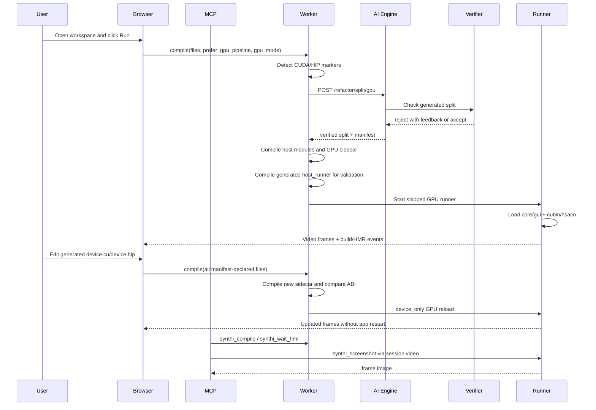

# GPU HMR In-Depth Flow

Last updated: 2026-05-18

This document explains the current Synthi GPU HMR path end to end: what the
user writes, what the browser sends, what the worker asks the AI engine to
generate, how the generated files are compiled, how device-only HMR is applied,
and how to validate the result through MCP.

The current live implementation is C++ with CUDA or HIP/ROCm kernels. It is
render-library and framework agnostic inside that C++ GPU scope: the splitter
must preserve the user's original rendering backend instead of assuming SDL2,
GLFW, winit, OpenGL, Vulkan, etc. Broader language support is a future runtime
contract problem, not something this path can honestly claim today.

## Tiny Glossary

- **Synthi**: the Vectant workspace/runtime system that compiles, runs, streams,
  and hot-reloads user projects.
- **HMR**: Hot Module Replacement; rebuilding and swapping changed code without
  restarting the whole running app.
- **GPU HMR**: Synthi HMR extended so CUDA/ROCm device sidecars can be rebuilt
  and swapped while host state and registered GPU buffers survive.
- **ABI**: Application Binary Interface; the fixed exported functions and data
  shapes the runner uses to load generated modules safely.
- **MCP**: the agent-facing Model Context Protocol tool server used to attach to
  workspaces, compile, wait for HMR, and capture screenshots.
- **Sidecar**: the compiled GPU artifact loaded beside the host modules:
  `cubin` for CUDA or `hsaco` for ROCm/HIP.

## One-Screen Summary

User source does not need Synthi HMR ABI functions.

The intended user path is:

```text
ordinary user source with CUDA/HIP kernels
  -> browser/MCP sends compile request with files + GPU preference
  -> worker detects GPU markers
  -> worker calls ai-engine /refactor/split/gpu
  -> AI engine generates Synthi split files and a build manifest
  -> verifier rejects bad generated splits
  -> worker compiles host modules and GPU sidecar
  -> shipped GPU runner starts with generated core/gui/device ABI files
  -> later device-only edit compiles only device.cu/device.hip sidecar
  -> GPU reload planner chooses plan=device_only when ABI is unchanged
  -> runner hot-loads new cubin/hsaco without restarting app state
```

The live demo proves **GPU compute HMR**: HIP/CUDA updates particle coordinates
on the GPU, the app copies those coordinates back to CPU-visible state, and the
GUI renders them. It does not prove zero-copy CUDA/HIP-to-graphics interop or
direct GPU framebuffer rendering.

The latest live validation workspace was:

```text
http://localhost:3000/workspace/gpu-ai-flow-shot-20260518003220
```

The latest validation artifacts were captured through MCP `synthi_screenshot`:

```text
mcp/synthi-mcp/.gpu-hmr-test-artifacts/gpu-ai-flow-shot-20260518003220-mcp-screenshot-1.png
mcp/synthi-mcp/.gpu-hmr-test-artifacts/gpu-ai-flow-shot-20260518003220-mcp-screenshot-2.png
```

## Sequence Diagram



## Main Components

### Frontend

Important files:

```text
synthi/src/app/workspace/[slug]/page.jsx
synthi/src/services/compilerClient.js
synthi/src/redux/uiSlice.js
synthi/src/app/workspace/TopNav.jsx
synthi/src/components/SettingsPanelContent.jsx
```

Responsibilities:

- Maintain user GPU target preference: `auto`, `cuda`, `rocm`.
- Send `prefer_gpu_pipeline` and `gpu_mode` in compile requests.
- For already-adapted workspaces, discover compile files from manifest data
  instead of hardcoded filenames.
- Keep the current editor/workspace experience the same: the user edits files,
  clicks run/compile, and sees HMR status.

### MCP

Important files:

```text
mcp/synthi-mcp/src/*
mcp/synthi-mcp/scripts/gpu-hmr-agent-split-workspace-test.mjs
mcp/synthi-mcp/scripts/gpu-hmr-dynamic-workspace-test.mjs
mcp/synthi-mcp/scripts/gpu-hmr-test.mjs
```

Responsibilities:

- Attach to a running workspace session.
- Call `synthi_compile` like an agent or user path would.
- Call `synthi_wait_hmr` to wait for an HMR terminal event.
- Call `synthi_screenshot` to prove the app is visually running after compile
  and reload.

The MCP path is important because it validates the same public tools an agent
uses. A passing compiler log alone is not enough.

### Worker

Important files:

```text
backend/synthi-webrtc-compiler/worker/src/compiler/handler.rs
backend/synthi-webrtc-compiler/worker/src/compiler/stages/ai_utils.rs
backend/synthi-webrtc-compiler/worker/src/hmr/gpu_module_adapter.rs
backend/synthi-webrtc-compiler/worker/src/hmr/compile_manifest.rs
backend/synthi-webrtc-compiler/worker/Dockerfile.gpu
```

Responsibilities:

- Receive compile requests over WebRTC data channels.
- Detect CUDA/HIP markers in source.
- Route GPU first-compile splits to `/refactor/split/gpu`.
- Reject GPU-preferred compile if the GPU split endpoint fails instead of
  silently falling back to the CPU splitter.
- Normalize and persist generated split output.
- Compile host code and device sidecar.
- Track device ABI fingerprints.
- Plan and apply GPU HMR reloads.

### AI Engine

Important files:

```text
ai-backend/ai-engine/llm/prompts.py
ai-backend/ai-engine/verifier_gpu.py
ai-backend/ai-engine/main.py
```

Responsibilities:

- Run the GPU split prompt.
- Return the five-file GPU split plus manifest metadata.
- Verify generated output mechanically before returning it to the worker.
- Retry with verifier feedback when generated output is invalid.

The model used by the current harness is Gemini through ai-engine. The harness
default is:

```text
SYNTHI_GEMINI_MODEL=gemini-3-flash-preview
```

unless the environment overrides it.

## What The User Writes

For the full agent-split path, the user starts with ordinary monolithic source.
It should not contain Synthi ABI exports.

Example properties of valid user source:

- It contains normal C++ app code.
- It contains CUDA/HIP kernels or launch sites.
- It uses any supported rendering/windowing backend it already had.
- It does not need `core_on_update`, `gui_on_render`, `device_on_load`,
  `device_descriptor`, or `device_kernel_sig_hash`.

The AI split is responsible for creating those ABI files and functions.

## What The Browser Sends For Compile

The compile request includes:

```json
{
  "language": "cpp",
  "filename": "main.cpp",
  "source": "...active source...",
  "files": [
    { "name": "main.cpp", "content": "..." }
  ],
  "use_ai_split": true,
  "prefer_gpu_pipeline": true,
  "gpu_mode": "auto",
  "compile_manifest": null,
  "slug": "workspace-slug"
}
```

For a first compile of ordinary monolithic user source:

- `files` usually contains the active user files.
- `compile_manifest` is absent or null.
- `use_ai_split=true` allows the worker to call the AI split path.
- `prefer_gpu_pipeline=true` tells the worker to prefer GPU-aware splitting
  when GPU markers are present.
- `gpu_mode` can be `auto`, `cuda`, `rocm`, or `disabled`.

For an already-adapted workspace:

- The browser searches for `.synthi/build_manifest.json`,
  `synthi/build_manifest.json`, or `.synthi_split_meta.json`.
- It reads `compile_manifest.files`.
- It reads every role in `compile_manifest.module_files`.
- It sends those manifest-declared files rather than a fixed hardcoded list.
- It falls back to the old default file names only for old manifests.

This is what makes dynamic filenames work. A workspace can use paths like:

```text
src/state/shared_runtime_abc123.h
host/core_loop_abc123.cpp
render/gui_surface_abc123.cpp
gpu/kernels/particle_kernel_abc123.hip
.synthi/build_manifest.json
```

as long as the manifest declares the roles.

## GPU Target Selection

There are two related decisions:

### User GPU Preference

The UI setting controls compile intent:

```text
auto
cuda
rocm
```

That value is sent as `gpu_mode`.

Meaning:

- `auto`: worker/stack chooses based on available GPU/toolchain and source.
- `cuda`: prefer CUDA/NVIDIA split output.
- `rocm`: prefer HIP/ROCm split output.
- `disabled`: do not use the GPU pipeline.

### Docker Device Exposure

The worker image can ship both CUDA and ROCm toolchains, but Docker still needs
host-specific device exposure.

NVIDIA uses:

```text
docker-compose.nvidia.yml
gpus: all
NVIDIA Container Toolkit
```

AMD WSL uses:

```text
docker-compose.gpu-amd.yml
/dev/dxg
ROCDXG / libdxcore exposure
```

The image can be universal. The compose override cannot be fully universal
because Docker exposes NVIDIA and AMD WSL devices differently.

## Security And Isolation Constraints

GPU HMR compiles and executes AI-generated C++ plus CUDA/HIP code. Treat that
code as untrusted unless the workspace itself is trusted.

Current development validation runs the app inside the worker container, not as
a native host process. That container boundary is useful, but it is not a
complete security sandbox:

- GPU device exposure grants the container access to the selected host GPU
  bridge (`gpus: all` for NVIDIA, `/dev/dxg` for AMD WSL).
- Build containers may have broad toolchains and filesystem access needed for
  compiling generated native code.
- Environment variables and mounted paths must be treated as sensitive.
- A generated native binary can still consume CPU, memory, disk, GPU memory, or
  driver resources aggressively.

For production or hostile multi-tenant workloads, run GPU workers with a
least-privilege profile:

- No unnecessary host mounts.
- No long-lived credentials in the worker environment.
- Per-user or per-job isolation boundaries.
- Resource limits for CPU, memory, disk, and GPU where the platform supports
  them.
- Network egress controls if generated code should not call external services.
- Separate validation workers from developer machines.

The HMR ABI and verifier improve correctness of generated code; they are not a
security proof. Security has to come from the execution environment.

## AI Split Routing

The worker checks `prefer_gpu_pipeline`, `gpu_mode`, and GPU source markers.

When all of these are true:

```text
prefer_gpu_pipeline=true
gpu_mode != disabled
source contains CUDA/HIP markers
```

the worker calls:

```text
POST /refactor/split/gpu
```

If that GPU split route fails or returns no split result, the worker returns a
compile error for GPU-preferred compiles. It must not silently fall back to the
host-only CPU splitter, because that can drop the GPU manifest and produce a
workspace that compiles incorrectly or cannot HMR the device sidecar.

## GPU Split Prompt Contract

The GPU split prompt is not supposed to be a demo-specific prompt.

It tells the model to emit:

```text
shared.h
core.cpp
gui.cpp
host_runner.cpp
device.cu or device.hip
.synthi/build_manifest.json
```

The generated ABI functions live in generated source, not in user source.

Host lifecycle exports:

```cpp
extern "C" void* core_on_load(void* prev_state, void* renderer);
extern "C" void core_on_update(void* state_ptr, double dt);
extern "C" void* gui_on_load(void* prev_state, void* window_ptr, void* core_state_ptr);
extern "C" void gui_on_render(void* state_ptr);
```

GPU lifecycle exports in `core.cpp`:

```cpp
extern "C" const DeviceDescriptor* device_descriptor();
extern "C" int device_on_load(void* state_ptr, const SynthiGpuRuntime* gpu);
extern "C" size_t device_save_size(void* state_ptr);
extern "C" int device_save_write(void* state_ptr, void* dst, size_t cap);
extern "C" unsigned long long device_kernel_sig_hash();
```

Important: these are not user-facing requirements. They are the generated split
contract between Synthi and the hot runtime.

The prompt must preserve:

- Original rendering library/backend.
- Original state semantics.
- Every kernel branch.
- Every guard and reset path.
- Every boundary condition.
- Every constant that affects behavior.
- Host/device copy behavior.
- Device allocation and launch semantics, mechanically routed through Synthi's
  GPU runtime ABI.

The prompt must not:

- Invent SDL2 if the user did not use SDL2.
- Recover windows/renderers through hardcoded global IDs.
- Allocate `AppState` with `new`, `malloc`, `calloc`, or smart pointers.
- Redeclare `synthi_gpu_runtime.h` structs/functions by hand.
- Put GPU lifecycle exports in `device.cu` or `device.hip`.
- Drop kernel branches or reset paths because the current demo seems to work.

## Verifier Contract

The verifier is the guardrail that keeps the model honest.

It checks generated output for things like:

- Missing host GPU lifecycle exports in `core.cpp`.
- GPU lifecycle exports placed in the device file.
- Heap-allocated `AppState`.
- Bad runtime launch argument shape.
- Known bad rendering handle patterns such as recovering a renderer through a
  hardcoded SDL window ID.
- Missing device file or wrong vendor extension.

Some verifier checks are backend-specific anti-patterns. That does not mean
the prompt or product is SDL-specific. For example, rejecting
`SDL_GetWindowFromID(1)` is a mechanical rejection of a known bad generated
split when the user happened to use SDL2. The positive instruction remains:
preserve the user's rendering backend and use the runner-provided render
surface.

The latest live validation showed this working:

```text
attempt 1 rejected: gui_uses_global_window_id_lookup
attempt 2 rejected: missing device_descriptor/device_on_load/device_kernel_sig_hash
attempt 3 accepted
```

## Generated Manifest

The generated manifest is the source of truth for adapted workspaces.

It needs to declare role paths, for example:

```json
{
  "files": [
    "shared.h",
    "core.cpp",
    "gui.cpp",
    "host_runner.cpp",
    "device.hip"
  ],
  "module_files": {
    "shared": "shared.h",
    "core": "core.cpp",
    "gui": "gui.cpp",
    "runner": "host_runner.cpp",
    "device": "device.hip"
  },
  "gpu": {
    "vendor": "rocm",
    "device_source": "device.hip",
    "arch": "gfx1201"
  }
}
```

The actual filenames can be dynamic. The manifest tells the browser and worker
which file has which role.

## First Compile Flow

Detailed first-compile flow:

```text
1. User opens a workspace with monolithic GPU source.
2. User enables GUI, GPU, and optionally HMR.
3. User selects GPU target: auto/cuda/rocm.
4. Browser or MCP calls compile.
5. Compile request reaches worker.
6. Worker detects GPU markers.
7. Worker attaches GPU target preference prompt.
8. Worker calls ai-engine /refactor/split/gpu.
9. AI engine asks the model for the five-file split.
10. AI engine runs verifier_gpu.py.
11. If verifier rejects output, ai-engine retries with feedback.
12. Worker receives verified split.
13. Worker writes runtime support headers such as synthi_gpu_runtime.h.
14. Worker compiles host modules.
15. Worker compiles device sidecar with nvcc or hipcc.
16. Worker compiles `host_runner.cpp` for build feedback.
17. For GPU manifests, worker starts the shipped GPU runner, not the generated
    host_runner binary.
18. The shipped runner loads generated core/gui modules and the device sidecar.
19. Browser receives build/HMR status and video frames.
```

Expected good worker markers:

```text
[AI Split] GPU markers detected; calling GPU split endpoint
[compile-device] hipcc
[HMR] gpu manifest present: using shipped runner for GPU runtime boundary; per-project host_runner compiled only
Device sidecar reload vendor=rocm ... result=Success
```

or on NVIDIA:

```text
[compile-device] nvcc
Device sidecar reload vendor=cuda ... result=Success
```

## Device-Only HMR Flow

After the first split exists, the fast path is no longer a full AI split.

Detailed device-only edit flow:

```text
1. User edits generated device.cu/device.hip.
2. Browser sees workspace manifest.
3. Browser sends all manifest-declared files.
4. Worker classifies the edit as a split-file edit.
5. Worker compiles the new device sidecar.
6. Worker extracts kernel signature and ABI fingerprint.
7. GPU reload planner compares old/new ABI fingerprint.
8. If ABI is compatible, planner emits plan=device_only.
9. Runner hot-loads the new cubin/hsaco.
10. Registered GPU buffers and AppState survive.
11. Browser/MCP observes HMR applied and new frames.
```

Expected markers:

```text
[HMR] FallbackDeterministic -> split file edit (device.hip)
[gpu-reload] plan=device_only
Device sidecar reload vendor=rocm ... result=Success
```

If the kernel signature changes in an ABI-breaking way, the planner should
emit:

```text
[gpu-reload] plan=abi_breaking
```

That is not the fast path; it requires a colder reload path.

## MCP Validation Flow

MCP validation proves the end-user/agent path, not just internal functions.

The full validation harness:

```text
mcp/synthi-mcp/scripts/gpu-hmr-agent-split-workspace-test.mjs
```

does this:

```text
1. Creates a workspace.
2. Writes only monolithic user source.
3. Calls MCP synthi_compile with:
   - use_ai_split=true
   - prefer_gpu_pipeline=true
   - gpu_mode=<detected vendor>
4. Waits for HMR through synthi_wait_hmr.
5. Reads generated split files from the worker temp workspace.
6. Persists generated split files back into the workspace.
7. Edits the generated device file only.
8. Calls MCP synthi_compile again.
9. Waits for device-only HMR.
10. Checks worker logs for GPU compile/reload markers.
11. Confirms the runner stayed alive.
```

The screenshot validation uses the MCP server directly:

```text
synthi_attach
synthi_screenshot
```

This confirms the WebRTC video path is alive and the generated app is rendering
after the AI split and GPU HMR reload.

## How To Run The Stack

From repo root:

```powershell
cd C:\Users\polek\Downloads\test-agent\vectant-ade
.\scripts\start-gpu-stack.ps1
```

Manual AMD stack:

```powershell
cd C:\Users\polek\Downloads\test-agent\vectant-ade
docker compose -f docker-compose.yml -f docker-compose.gpu-amd.yml up -d --force-recreate redis postgres y-sweet collab-server signaling-server ai-engine ai-gateway frontend worker coturn mcp
```

Manual NVIDIA stack:

```powershell
cd C:\Users\polek\Downloads\test-agent\vectant-ade
docker compose -f docker-compose.yml -f docker-compose.nvidia.yml up -d --force-recreate redis postgres y-sweet collab-server signaling-server ai-engine ai-gateway frontend worker coturn mcp
```

If images need rebuilding:

```powershell
docker compose build ai-engine
docker compose -f docker-compose.yml -f docker-compose.gpu-amd.yml build worker
```

or for NVIDIA:

```powershell
docker compose -f docker-compose.yml -f docker-compose.nvidia.yml build worker
```

## How To Run Full AI Split Validation

From repo root:

```powershell
cd C:\Users\polek\Downloads\test-agent\vectant-ade\mcp\synthi-mcp

$env:SYNTHI_GPU_HMR='1'
$env:SYNTHI_GPU_VENDOR='auto'
Remove-Item Env:SYNTHI_GPU_ARCH -ErrorAction SilentlyContinue
$env:SLUG='gpu-ai-flow-' + (Get-Date -Format 'yyyyMMddHHmmss')
$env:MCP_CONTAINER='vectant-ade-mcp-1'
$env:WORKER_CONTAINER='vectant-ade-worker-1'
$env:MCP_SIGNALING_URL='ws://signaling-server:9000'
$env:SYNTHI_SYNC_TO_GCS='0'

node scripts/gpu-hmr-agent-split-workspace-test.mjs
```

Expected summary:

```text
PASS gpu vendor
PASS monolithic source has no Synthi ABI
PASS first compile via MCP - use_ai_split=true prefer_gpu_pipeline=true
PASS worker used GPU split endpoint
PASS generated device compiled
PASS generated split contains HMR ABI
PASS device edit compile via MCP
PASS generated device file used for HMR
PASS device-only GPU HMR observed
PASS runner stayed alive after GPU HMR
```

Open:

```text
http://localhost:3000/workspace/<slug>
```

## How To Capture MCP Screenshots

The direct way is to attach with the MCP server and call `synthi_screenshot`.
The validation harness already does this for the flow fixture. For ad-hoc
validation, use the same JSON-RPC pattern as the harness:

```text
initialize
notifications/initialized
tools/call synthi_attach
tools/call synthi_screenshot
```

The latest successful ad-hoc screenshot capture attached to:

```text
gpu-ai-flow-shot-20260518003220
```

and returned:

```text
tools=42 has_screenshot=true
attach ok=true connected=true
shot 1: 800x600, visible bright/color pixels
shot 2: 800x600, visible bright/color pixels
```

The two screenshots showed the particle field advancing, which proves that the
render loop and video path were alive after the AI split and device HMR reload.

## What Is Hardcoded And What Is Not

Hardcoded runtime ABI:

- Synthi module export names.
- Synthi GPU runtime boundary header.
- The five generated roles for the current C++ CUDA/HIP GPU path.
- Device sidecar ABI fingerprinting.

Not hardcoded:

- User source filenames.
- Adapted workspace filenames.
- Rendering library choice.
- CUDA vs ROCm target preference.
- The user's kernel body semantics.
- Whether a first compile was already adapted or needs AI split.

The ABI is hardcoded because the runner needs stable symbols to `dlsym`.
The user does not write those symbols; the AI split generates them.

## Common Failure Modes

### Browser Sends Only Active File

Symptom:

```text
missing synthi_gpu_runtime.h
missing shared.h
device file not found
```

Cause:

- The browser did not find or send the manifest-declared file set.

Fix:

- Ensure `.synthi/build_manifest.json` exists.
- Ensure `files` and `module_files` include every split role.
- Ensure the browser compile path sends all manifest-declared files.

### GPU Split Falls Back To CPU Split

Symptom:

```text
GPU source compiles as host-only split
missing compile_manifest.gpu
device-only HMR never triggers
```

Cause:

- GPU split endpoint failed or did not return a result and the worker fell back.

Current intended behavior:

- GPU-preferred compiles fail hard if `/refactor/split/gpu` fails.

### Generated Output Uses Wrong Renderer Recovery

Symptom:

```text
black window
blank screenshot
verifier rejection gui_uses_global_window_id_lookup
```

Cause:

- The model invented a renderer/window recovery path instead of preserving the
  runner-provided render surface.

Fix:

- Keep the backend-agnostic prompt language.
- Keep verifier rejection rules for known bad backend-specific patterns.

### Generated Device Drops Branches

Symptom:

```text
particles disappear after HMR
simulation works briefly then leaves viewport
```

Cause:

- The model omitted a reset/boundary branch from the original kernel.

Fix:

- The prompt must explicitly preserve every branch, guard, boundary condition,
  reset path, constant, and host/device copy.

### Heap AppState

Symptom:

```text
state not preserved
HMR corruption or lifecycle crashes
verifier rejection heap_allocated_app_state
```

Cause:

- Generated `core.cpp` used `new AppState`, `malloc`, `calloc`, or smart
  pointer allocation.

Fix:

- `AppState` must use static storage or the previous state pointer supplied by
  the runner.

## Current Evidence

Latest committed validation:

```text
fc04a116 test(gpu-hmr): record ai split screenshot validation
```

Latest run highlights:

```text
PASS first compile via MCP - use_ai_split=true prefer_gpu_pipeline=true
PASS worker used GPU split endpoint - GPU markers detected; calling GPU split endpoint
PASS generated device compiled - compile-device] hipcc
PASS generated split contains HMR ABI - shared.h, core.cpp, gui.cpp, host_runner.cpp, device.hip
PASS device-only GPU HMR observed - Device sidecar reload vendor=rocm ... result=Success
PASS runner stayed alive after GPU HMR - no runner crash marker
```

Latest AI engine behavior:

```text
split/gpu verifier rejected attempt 1: gui_uses_global_window_id_lookup
split/gpu verifier rejected attempt 2: missing_core_gpu_lifecycle_export
split/gpu attempt 3 returned 200
```

Latest screenshot evidence:

```text
synthi_screenshot returned 800x600 particle frames
frame 1 and frame 2 differed as the GPU simulation advanced
```

## Source Anchors

Use these when debugging:

```text
ai-backend/ai-engine/llm/prompts.py
  GPU_SPLIT_PROMPT

ai-backend/ai-engine/verifier_gpu.py
  verify generated GPU split output

backend/synthi-webrtc-compiler/worker/src/compiler/stages/ai_utils.rs
  perform_ai_split
  GPU split endpoint routing
  gpu_mode target prompt
  AI split cache schema

backend/synthi-webrtc-compiler/worker/src/hmr/gpu_module_adapter.rs
  device-only vs ABI-breaking reload plan

synthi/src/app/workspace/[slug]/page.jsx
  adapted manifest discovery
  manifest-driven file selection

synthi/src/services/compilerClient.js
  compile request payload
  prefer_gpu_pipeline
  gpu_mode
  compile_manifest

mcp/synthi-mcp/scripts/gpu-hmr-agent-split-workspace-test.mjs
  full user source -> AI split -> generated split -> GPU HMR validation

mcp/synthi-mcp/scripts/gpu-hmr-dynamic-workspace-test.mjs
  dynamic filename validation

mcp/synthi-mcp/scripts/gpu-hmr-test.mjs
  vector and visible flow fixtures
```
