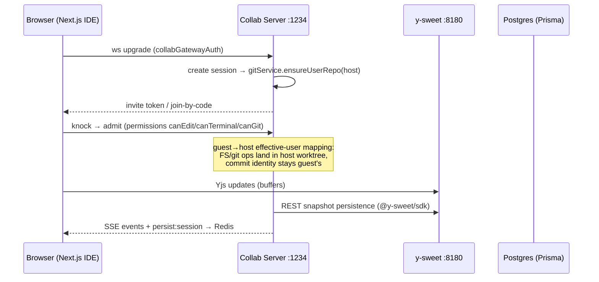
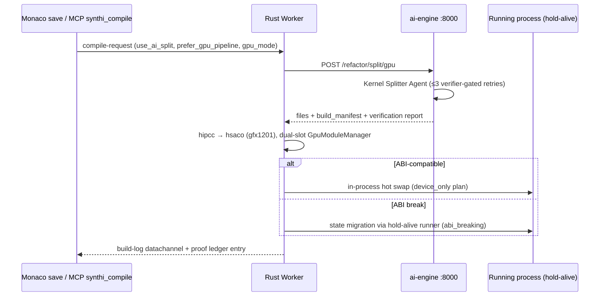

# Data Flow Walkthroughs

> End-to-end lifecycles through the stack, grounded in the per-system analyses. Follow the links for file-level references.

## 1. Human opens an IDE session

- Two "session" concepts: **collab sessions** (`SessionManager.js`, in-memory by design) and **runtime sessions** (worker pods, `warming→ready→running→hibernated/…` in `sessionLifecycle.js`).
- Every collab mutation emits `persist:session`; teardown arrives from signaling via `/api/spawner/session-ended`.
- Full detail: [[Collab Server]] §5.

## 2. GPU edit → live hot reload ([[GPU HMR System]])

- Fail-hard rule: GPU-preferred compile never silently falls back to CPU split.
- AI never certifies: mechanical verifiers (`verifier_gpu.py`) enforce the no-shim contract; broker is a fail-closed identity ledger with 138 reason codes.
- Proof = decoded visual before/after/diff through the changed path; wall-times recorded per run.
- Detail: [[GPU HMR System]], pipeline internals in [[AI Engine]] §5, worker side in [[Rust Systems]].

## 3. Agent joins and works ([[Dojo Codesite Local Support]])

1. **Attach**: agent session attaches to a collab session; filing an execution-plan on `agent-sessions/:id/execution-plans` may auto-open direct channels only in `direct_preferred` mode — registered_direct keeps the request→accept handshake. Subagents derive all ids/tokens from live state, never hardcoded.
2. **Tooling**: agent drives [[MCP Synthi]] tools (stdio or HTTP+bearer). ~70 codesite + ~69 dojo tools.
3. **Governance**: every repo mutation needs a CodeSite flight plan → MutationLease → transaction overlay; CodeSiteFS enforces path/symlink containment, five-field identity match, fail-closed denial if authority unreachable.
4. **Competency**: dojo licenses (E0–EX) gate what a skill capsule may do in production; license kernel checks proof capsules before any call.

## 4. Runtime streaming ([[Rust Systems]])

Browser ⇄ signaling-server :9000 (SDP/ICE, roles browser|worker|observer|mcp-agent; Redis pub/sub for multi-pod) ⇄ Rust worker (GStreamer → webrtc-rs video; datachannels for terminal/build-log/input). coturn mints TURN credentials on demand (also exposed to frontend via `/api/turn-credentials`). Android emulator path uses tonic gRPC against vendored AOSP protos.

## 5. AI assistance ([[AI Engine]] via [[Supporting Services]])

Editor/chat events → ai-gateway :7071 (WS⇄HTTP edge) → ai-engine :8000 (~166 routes): completion, next-edit, classify, healing analysis, code-intel queries, shadow/genome continuous runs. ai-engine calls LLM providers (env-driven split provider/model); it never compiles or runs user code itself — the Rust worker does. Disposable agent capsules run via agent-runner images under fail-closed container policy.

## 6. Local support pairing ([[Dojo Codesite Local Support]] §4)

Local Rust app ⇄ support session over signed pairing (ed25519 + DPAPI-protected keys). Every egress item classified L0–L5, secret-scanned, capability-receipted into a hash-chained audit; shell-free command broker; local app remains final authority — pause/revoke kills access instantly.

## Related

[[Architecture Overview]] · [[Dependency Graph]] · [[00 Home|🏠 Home]]
